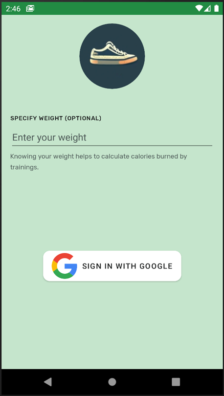
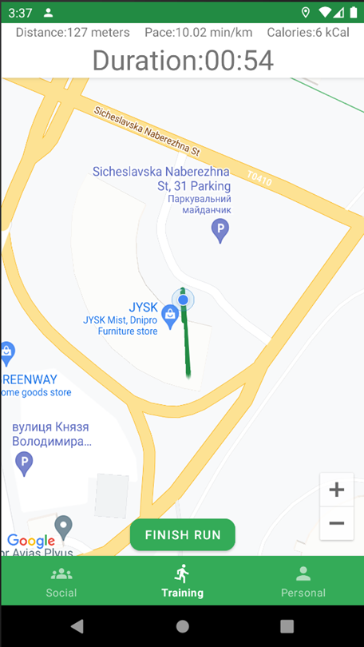
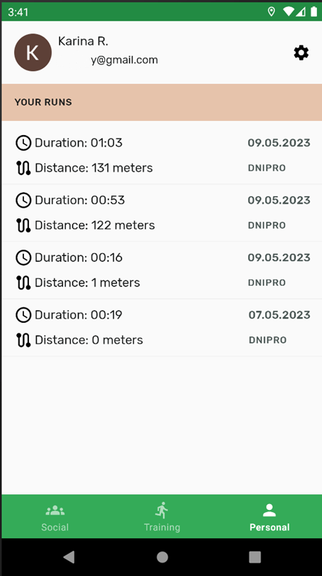
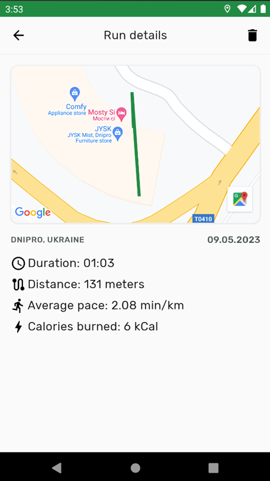
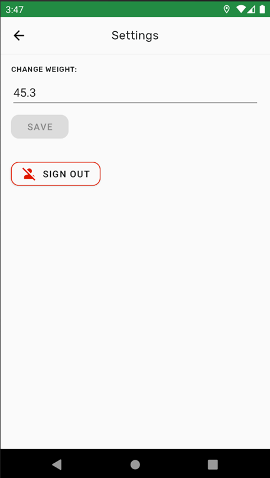
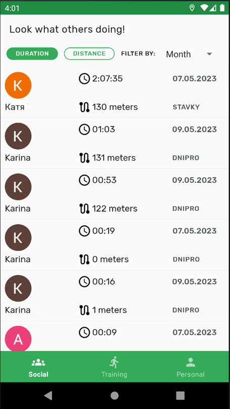

**RunningApp**
==================
A mobile Android application for tracking and analyzing running. Analyzes the position of the device and displays real-time running data, training is stored in a remote storage and can be viewed from other devices after authentication.

## Screenshots
     